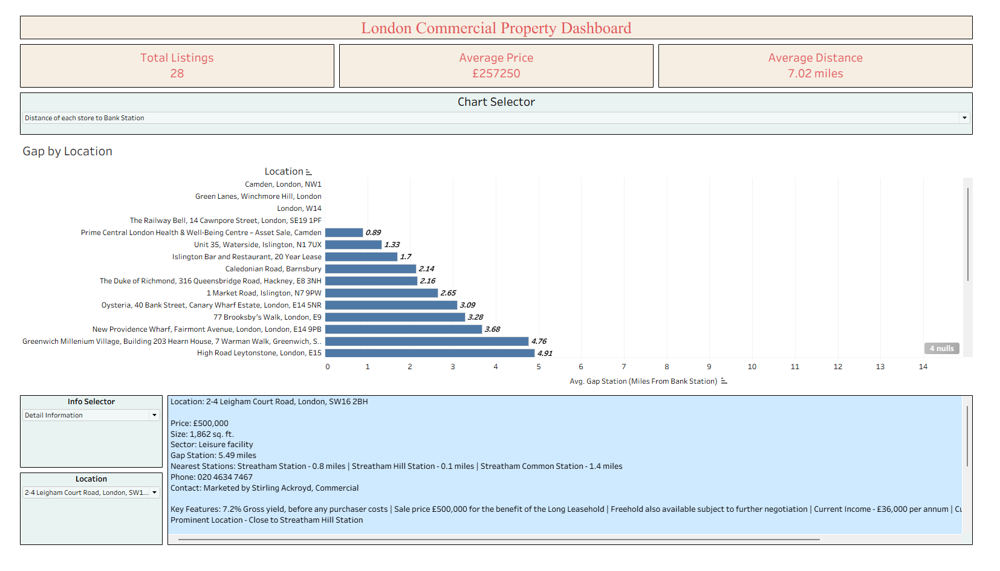
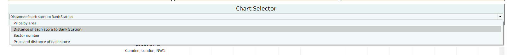
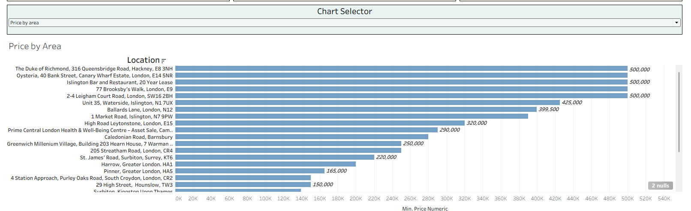
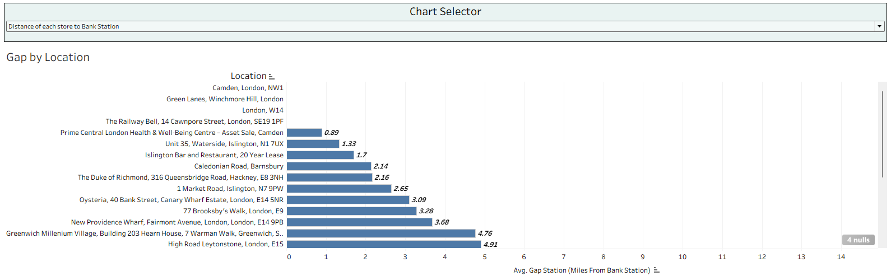
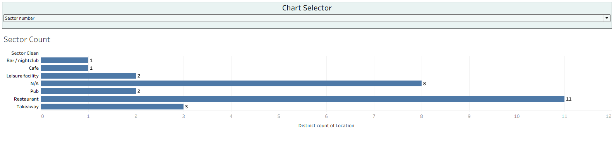
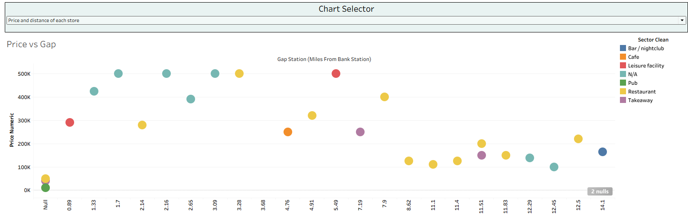
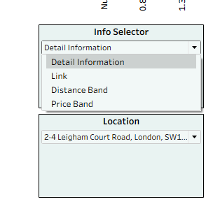
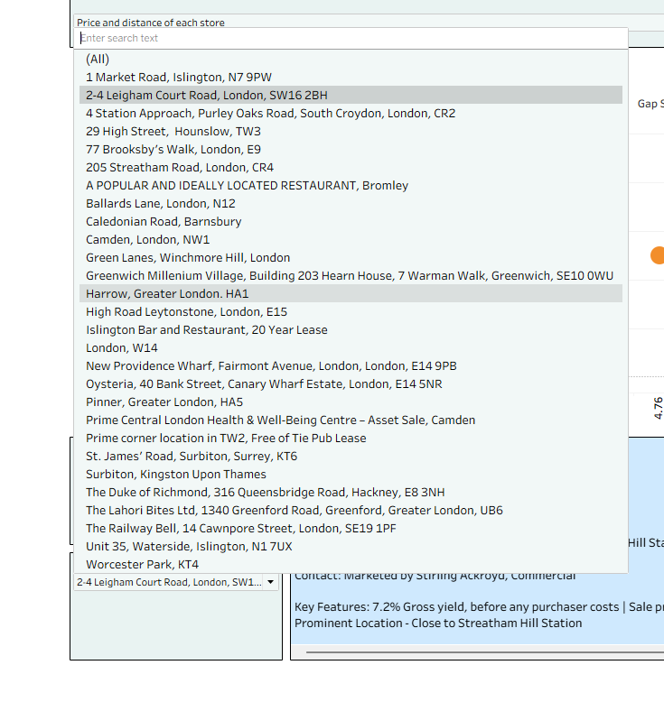
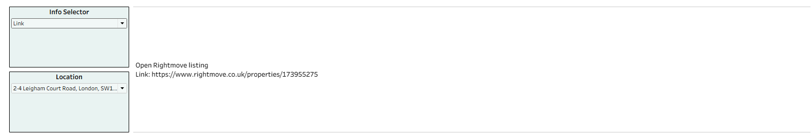
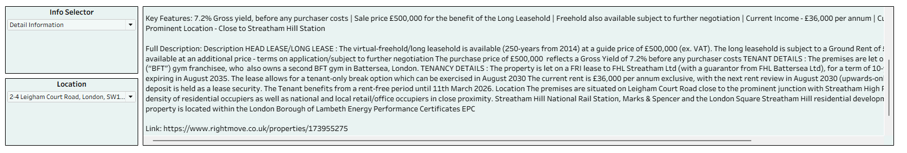

# Scrape data and analytics - London Commercial Property 

## 1. Project Overview

This project focuses on collecting, processing, and visualizing commercial property resale listings in London, especially businesses such as restaurants, cafés, takeaways, pubs, bars, nightclubs, and leisure facilities.

The main objective is to understand how asking prices vary depending on business sector and distance from **Bank Station**, which is used as the central reference point of London in this analysis.

The project uses:

- **Python** for web scraping
- **BeautifulSoup** for extracting listing information from web pages
- **Pandas** for data cleaning and structuring
- **CSV** for storing the scraped dataset
- **Tableau** for building an interactive dashboard

---

## 2. Business Context

London has a highly competitive commercial property market. For people who want to buy or take over a restaurant, café, takeaway, pub, or leisure business, price and location are two of the most important factors.

However, property listing websites usually present information separately for each listing. This makes it difficult to compare listings quickly by:

- asking price
- business sector
- distance from central London
- location
- nearby transport stations
- key property features

This project solves that problem by collecting listing data, cleaning it into a structured dataset, and presenting it in a Tableau dashboard for easier comparison and analysis.

---

## 3. Project Objectives

The project aims to answer the following questions:

1. What is the average asking price of commercial property listings in the dataset?
2. Which business sectors appear most frequently?
3. Which listings are closest to or furthest from Bank Station?
4. How does price change as distance from Bank Station increases?
5. Which locations have high prices despite being further away from the centre?
6. How can users quickly inspect detailed information and original listing links?

---

## 4. Data Collection

The data was collected using a Python web scraping notebook.

The scraper extracts commercial property listing information from Rightmove using:

- `requests` to send HTTP requests
- `BeautifulSoup` to parse HTML content
- `pandas` to store and export structured data

### Example collected fields

The dataset includes information such as:

- Location
- Price
- Size
- Sector
- Key features
- Full description
- Nearby stations
- Distance from Bank Station
- Contact phone number
- Agent/contact name
- Listing URL

---

## 5. Dataset Summary

From the dashboard, the current dataset contains:

- **Total listings:** 28
- **Average price:** £257,250
- **Average distance from Bank Station:** 7.02 miles

Bank Station is used as the central point to measure the distance of each listing from central London.

---

## 6. Tools and Technologies

| Tool | Purpose |
|---|---|
| Python | Data collection and processing |
| BeautifulSoup | HTML parsing and web scraping |
| Requests | Sending web requests |
| Pandas | Data cleaning and CSV export |
| Tableau | Interactive data visualization |
| GitHub | Project documentation and version control |

---

## 7. Project Workflow

```text
Rightmove Listings
        ↓
Python Web Scraping
        ↓
BeautifulSoup HTML Parsing
        ↓
Data Cleaning with Pandas
        ↓
CSV Dataset
        ↓
Tableau Dashboard
        ↓
Business Insight & Analysis
```

---

# 8. Dashboard Overview

The Tableau dashboard is designed to allow users to explore London commercial property listings interactively.

It contains:

- KPI cards
- chart selector
- location filter
- information selector
- price analysis chart
- distance analysis chart
- sector count chart
- price vs distance scatter plot
- detailed listing information panel
- original Rightmove listing link

---

## 8.1 Main Dashboard View



The main dashboard provides a high-level overview of the dataset.

At the top of the dashboard, three KPI cards summarize the dataset:

- **Total Listings:** number of commercial property listings collected
- **Average Price:** average asking price across all listings
- **Average Distance:** average distance from Bank Station

Below the KPI cards, the user can choose which chart to display using the **Chart Selector** dropdown.

The lower section contains:

- a chart area showing the selected analysis
- an information selector
- a location filter
- a detailed information panel for the selected listing

---

## 8.2 Chart Selector



The **Chart Selector** allows users to switch between different dashboard views.

Available chart options include:

1. **Price by area**
2. **Distance of each store to Bank Station**
3. **Sector number**
4. **Price and distance of each store**

This makes the dashboard more compact because users can explore multiple analyses within the same dashboard page instead of opening separate worksheets.

---

## 8.3 Price by Area



The **Price by Area** chart compares the asking price of each commercial property listing by location.

This view helps users identify:

- the most expensive listings
- lower-priced opportunities
- price differences across locations
- areas where commercial listings are concentrated around a similar price range

In this chart, several listings reach around **£500,000**, while other listings are priced much lower. This gives a quick overview of the price range in the dataset.

---

## 8.4 Distance from Bank Station



This chart shows the distance of each commercial property listing from **Bank Station**.

Bank Station is used as the central reference point because it is located in the City of London and represents a strong central business location.

This view helps users understand:

- which listings are closest to central London
- which listings are further away
- whether cheaper or more expensive listings tend to be closer to Bank Station
- how location distance may influence commercial value

For example, some listings are less than 2 miles from Bank Station, while others are more than 10 miles away.

---

## 8.5 Sector Count



The **Sector Count** chart shows how many listings belong to each business sector.

The sectors include:

- Restaurant
- Takeaway
- Pub
- Café
- Bar / nightclub
- Leisure facility
- N/A

This chart helps identify the most common business types in the dataset.

In this dataset, **restaurants** appear most frequently, followed by listings with missing or undefined sector values, then takeaway and pub listings.

---

## 8.6 Price vs Distance from Bank Station



The **Price vs Gap** scatter plot compares asking price against distance from Bank Station.

Each point represents one commercial property listing.

- The x-axis shows distance from Bank Station
- The y-axis shows asking price
- The color represents the business sector

This chart helps users analyze whether properties closer to Bank Station are always more expensive, or whether some listings further away still have high asking prices.

From this view, users can quickly compare price and distance at the same time. For example, some properties around 1 to 5 miles from Bank Station have high asking prices, while some properties further away have lower prices.

---

# 9. Dashboard Interactivity

## 9.1 Info Selector



The **Info Selector** allows the user to choose what type of information should be displayed for a selected listing.

Available options include:

1. **Detail Information**
2. **Link**
3. **Distance Band**
4. **Price Band**

This makes the dashboard more flexible because users can switch between descriptive details, listing links, and categorized information.

---

## 9.2 Location Filter



The **Location Filter** allows users to select a specific commercial property listing.

Users can search for a location by typing into the search box, or manually select from the dropdown list.

After selecting a location, the dashboard updates the detail panel below to show information about that selected listing.

This is useful when a user wants to inspect one property in more detail after seeing it in the chart.

---

## 9.3 Listing Link View



When the user selects **Link** from the Info Selector, the dashboard displays the original Rightmove listing URL.

This allows users to:

- open the original listing
- verify the source information
- read more details directly from Rightmove
- contact the agent if needed

---

## 9.4 Detailed Information View



When the user selects **Detail Information**, the dashboard displays a full summary of the selected listing.

The detail panel may include:

- price
- size
- sector
- distance from Bank Station
- nearest stations
- phone number
- contact name
- key features
- full description
- listing link

This turns the dashboard into both an analytical tool and a property inspection tool.

---

# 10. How to Use the Dashboard

## Step 1: Review KPI cards

Start by checking the top KPI cards:

- Total Listings
- Average Price
- Average Distance

These provide a quick summary of the dataset.

---

## Step 2: Choose a chart

Use the **Chart Selector** dropdown to choose the type of analysis:

- choose **Price by area** to compare asking prices
- choose **Distance of each store to Bank Station** to compare location distance
- choose **Sector number** to see the number of listings by business type
- choose **Price and distance of each store** to compare price and distance together

---

## Step 3: Select a location

Use the **Location** dropdown to choose a specific listing.

The dashboard will update the information panel based on the selected location.

---

## Step 4: Choose information type

Use the **Info Selector** to choose what you want to view:

- **Detail Information** for full listing details
- **Link** for the original listing URL
- **Distance Band** for distance category
- **Price Band** for price category

---

## Step 5: Interpret the results

Use the dashboard to compare:

- which listings are expensive
- which listings are close to Bank Station
- which sectors are most common
- whether price appears related to distance
- which properties may represent better commercial opportunities

---

# 11. Key Insights

Based on the current dashboard:

1. The dataset contains **28 commercial property listings**.
2. The average asking price is approximately **£257,250**.
3. The average distance from Bank Station is approximately **7.02 miles**.
4. Restaurants are the most common listed sector in the dataset.
5. Some high-priced listings are located relatively close to Bank Station.
6. Not all properties further from Bank Station are cheaper, which suggests that business type, size, lease terms, and local area may also influence price.
7. The dashboard allows users to move from a high-level market overview to detailed listing-level inspection.

---

# 12. Repository Structure

```text
london-commercial-property-analysis/
│
├── data/
│   └── rightmove_commercial_property_sample.csv
│
├── notebooks/
│   └── rightmove_scraper.ipynb
│
├── dashboard/
│   └── london_commercial_property_dashboard.twb
│
├── images/
│   ├── dashboard_main.png
│   ├── chart_selector_options.png
│   ├── price_by_area.png
│   ├── distance_from_bank.png
│   ├── sector_count.png
│   ├── price_vs_gap.png
│   ├── info_selector.png
│   ├── location_filter.png
│   ├── listing_link_view.png
│   └── detail_information_view.png
│
├── README.md
├── requirements.txt
├── .gitignore
└── LICENSE
```

---

# 13. How to Run the Project
Download ZIP and open file to use
Or Clone the repository:

```bash
git clone https://github.com/YOUR_USERNAME/london-commercial-property-analysis.git
```

Move into the project folder:

```bash
cd london-commercial-property-analysis
```

Install dependencies:

```bash
pip install -r requirements.txt
```

Open the notebook:

```bash
jupyter notebook notebooks/rightmove_scraper.ipynb
```

Open the Tableau dashboard file:

```text
dashboard/london_commercial_property_dashboard.twb
```

---

# 14. Future Improvements

Possible improvements include:

- publishing the dashboard on Tableau Public
- increasing the number of scraped listings
- adding more London reference points, not only Bank Station
- adding postcode-level geospatial analysis
- creating price bands and distance bands more clearly
- automating the scraping process
- building a Streamlit web application


